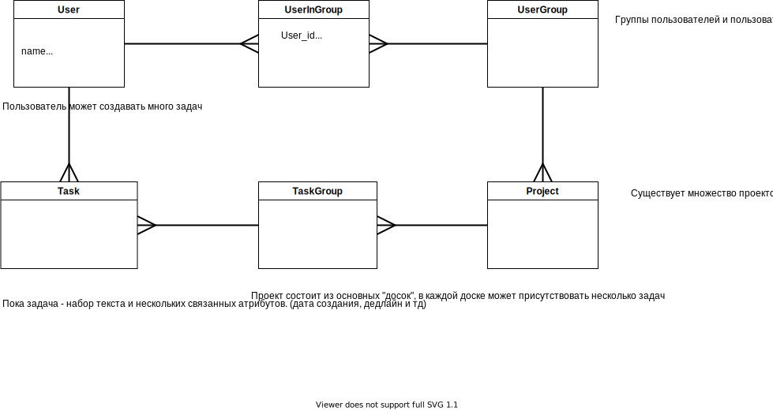

# TODO-DJANGO
## Песочный проект для изучения фреймворка django и связанных web технологий

### Предполагается разработать приложение для работы с списком задач. Постепенно функционал приложения будет расширятся. Базовые возможности:
* Авторизация
* Создание и управление задачами
* Создание групп задач
* Создание групповых досок для команд разработчиков
* Поддержка разделения ролей и прав в команде
* Комментарии пользователей
* Лог действий
* Поддержка загрузки картинок\файлов в задачи (не только текст)
* ...
## План действий
* Определение функционаал
* Разграничение прав пользователей
* Создание схемы БД
* Программирование
* ...
## Технологии
* Python + Django + Sql = backend
* Vue + Bootstrap = frontend
* В качестве БД поначалу годиться использование sqlite, далее миграция на что-то более серьёзное. 

## БД
Предполагаемая база данных \

